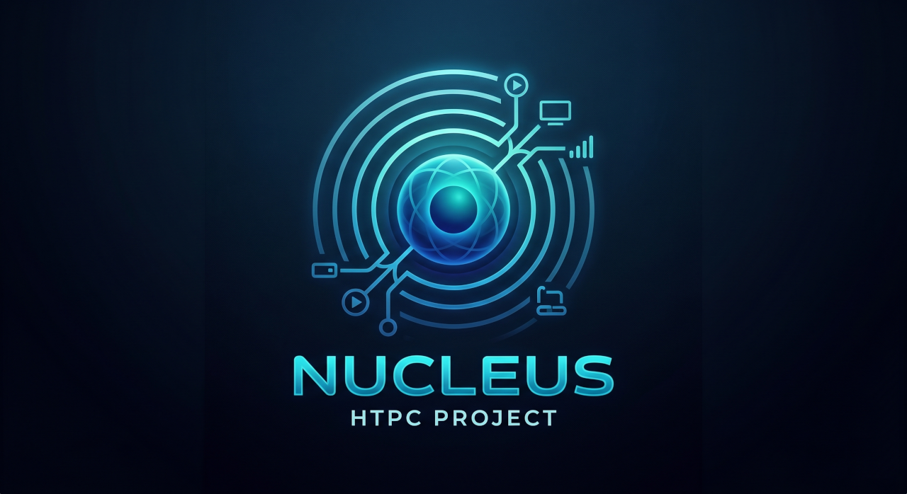

  

# Nucleus HTPC

Nucleus HTPC is a native Windows desktop application designed to provide a premium, large-screen media center experience. Built with .NET and WPF, it acts as a dedicated frontend for Channels DVR servers and leverages a custom-compiled MPV engine for state-of-the-art video playback and real-time upscaling.

## Features

* **Advanced MPV Playback Engine:** Utilizes `libmpv` and the modern `gpu-next` renderer to ensure high-quality video decoding, smooth playback, and superior HDR-to-SDR tonemapping.
* **Opt-In Video Upscaling Pipeline:** Includes a configurable hardware upscaling engine using GLSL compute shaders. Users can select between Native rendering, RAVU for mid-range GPUs, and ArtCNN for high-end hardware.
* **Real-Time Anime Mode:** A dedicated hot-swap toggle on the player overlay that instantly injects the Anime4K shader into the video pipeline, optimizing 2D animated content without interrupting playback.
* **Channels DVR Integration:** Connect, manage, and switch between multiple local Channels DVR servers directly from the interface. 
* **10-Foot User Interface:** Features a high-contrast dark mode design, fully optimized for remote control navigation and large living room displays.
* **Custom DVR Preferences:** Configure default start and end padding times for scheduled television recordings.
* **Dynamic Display Scaling:** Includes built-in UI scale adjustments to ensure perfect visibility across 1080p and 4K televisions.

## Server Interactions

Nucleus HTPC acts as a direct client to your Channels DVR server. All actions taken within the app are synced back to the server in real time so your data stays consistent across all your devices.

* **Media Retrieval**: Fetches your available movies, TV shows, Up Next queue, and the live TV guide.
* **Playback Tracking**: Sends your current watch duration back to the server so you can resume videos exactly where you left off.
* **Watch Status**: Marks individual movies and episodes as watched or unwatched.
* **DVR Scheduling**: Schedules direct recordings for individual upcoming live TV broadcasts.
* **Series Passes**: Creates automated recording passes for entire TV series.
* **Channel Management**: Updates your server-side preferences when you favorite or hide specific live TV channels.
* **Server Maintenance**: Triggers backend server actions like scanning for newly added files, pruning deleted media, fetching guide updates, and clearing the streaming cache.