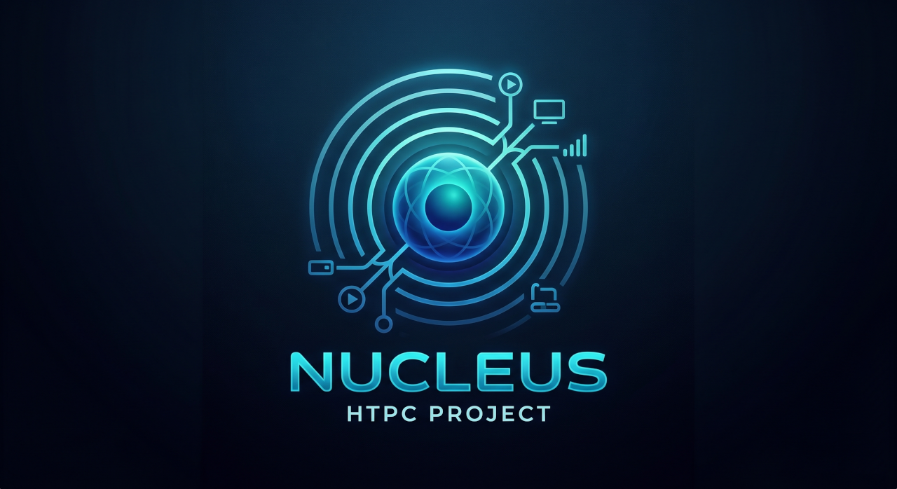

  

### Nucleus HTPC is not affiliated, associated, authorized, endorsed by, or in any way officially connected with Channels DVR or its developers (Fancy Bits LLC).

# Nucleus HTPC

Nucleus HTPC is a native Windows desktop application designed to provide a premium, large-screen media center experience. Built with .NET and WPF, it acts as a dedicated frontend for Channels DVR servers and leverages a custom-compiled MPV engine for state-of-the-art video playback and real-time upscaling.

## Features

* **Advanced MPV Playback Engine:** Utilizes `libmpv` and the modern `gpu-next` renderer to ensure high-quality video decoding, smooth playback, and superior HDR-to-SDR tonemapping.
* **Opt-In Video Upscaling Pipeline:** Includes a configurable hardware upscaling engine using GLSL compute shaders. Users can select between Native rendering, RAVU for mid-range GPUs, and ArtCNN for high-end hardware.
* **Real-Time Anime Mode:** A dedicated hot-swap toggle on the player overlay that instantly injects the Anime4K shader into the video pipeline, optimizing 2D animated content without interrupting playback.
* **Multi-View Playback:** Watch multiple live TV streams simultaneously for an ultimate sports or news viewing experience.
* **Live TV Mini-Guide:** An unobtrusive, horizontal overlay guide that automatically syncs to your currently playing channel without interrupting playback.
* **Channels DVR Integration:** Connect, manage, and switch between multiple local Channels DVR servers directly from the interface. 
* **10-Foot User Interface:** Features a high-contrast dark mode design, fully optimized for remote control navigation and large living room displays.
* **Custom DVR Preferences:** Configure default start and end padding times for scheduled television recordings.
* **Dynamic Display Scaling:** Includes built-in UI scale adjustments to ensure perfect visibility across 1080p and 4K televisions.
* **Built-in Auto Updater:** Automatically checks GitHub for new releases on startup and displays a non-intrusive update banner.
* **Pluto TV VOD Integration:** Seamlessly browse and launch Pluto TV's Video on Demand catalog directly from the HTPC interface using deep-link Android TV tuning and a native seamless pre-roll overlay.

## Installation

Nucleus HTPC is distributed as a self-contained Windows application, meaning you do not need to install the .NET runtime separately.

1. Navigate to the [Releases](https://github.com/nuken/htpc/releases) page.
2. Download the latest `NucleusHTPC_Installer_vX.X.X.exe` file.
3. Run the installer.
4. Launch the application from your Start Menu or Desktop shortcut. The application will guide you through connecting to your local Channels DVR server.

## Navigation & Remote Control

The application is built explicitly for a 10-foot living room experience and relies heavily on spatial keyboard and remote control navigation rather than a mouse. 

The primary navigation and control scheme was developed and tested using the **Rii Mini i25 USB remote control**, ensuring that standard directional inputs (Up, Down, Left, Right), Enter/OK, Back, and media playback keys map perfectly to the interface out of the box.

## Server Interactions

Nucleus HTPC acts as a direct client to your Channels DVR server. All actions taken within the app are synced back to the server in real time so your data stays consistent across all your devices.

* **Media Retrieval**: Fetches your available movies, TV shows, Up Next queue, and the live TV guide.
* **Playback Tracking**: Sends your current watch duration back to the server so you can resume videos exactly where you left off.
* **Watch Status**: Marks individual movies and episodes as watched or unwatched.
* **DVR Scheduling**: Schedules direct recordings for individual upcoming live TV broadcasts.
* **Series Passes**: Creates automated recording passes for entire TV series.
* **Channel Management**: Updates your server-side preferences when you favorite or hide specific live TV channels.
* **Server Maintenance**: Triggers backend server actions like scanning for newly added files, pruning deleted media, fetching guide updates, and clearing the streaming cache.

## VOD Integration (Pluto TV)

Nucleus HTPC now supports browsing and playing Pluto TV's Video on Demand (VOD) catalog natively. Instead of relying solely on Channels DVR, the HTPC commands a local Android TV or Fire TV device to seamlessly tune and stream the content via a capture card or network encoder.

### Requirements & Setup
To use the VOD features, you must configure the companion proxy tool to handle the tuning requests.

1. **Android ADB Bridge (v5.1.9+):** You must be running Android ADB Bridge version 5.1.9 or newer.
2. **Pluto TV App:** The Pluto TV app must be installed and logged in on your target Android TV / Fire OS streaming stick.
3. **Provider Configuration:** In your ADB Bridge web dashboard, you must add Pluto TV as a Provider using the following exact application intents:
   * **Package Name:** `tv.pluto.android`
   * **Component (Activity):** `com.cbs.app.tv.ui.activity.HomeActivity`
4. **Enable in HTPC Settings:** Open Nucleus HTPC, navigate to the **Settings** menu, toggle **Enable ADB VOD Bridge** to ON, and enter the local IP address and port of your ADB Bridge server (e.g., `http://192.168.1.50:8888`).  

### How to Use
Once the ADB Bridge is configured and running on your network:
1. Open Nucleus HTPC and navigate to the **VOD** tab. (The app will automatically sync and cache the latest movie catalog directly from Pluto TV's API on startup).
2. Select a movie to view its details and press **Play**.
3. The HTPC will immediately display a seamless pre-roll movie poster while simultaneously commanding your Android device to deep-link directly into the requested movie. 
4. The moment the video begins decoding, the pre-roll overlay will vanish, allowing you to watch the VOD with full MPV playback and upscaling support.

## Keyboard Commands

**Playback & Timeline Control**

* **Spacebar or P:** Play / Pause.
* **Left Arrow (Single Tap):** Skip backward.
* **Left Arrow (Hold):** Scrub fast-backward through the timeline.
* **Left Arrow (Double-Tap):** Trigger Instant Replay (jumps back and plays in slow motion).
* **Right Arrow (Single Tap):** Skip forward.
* **Right Arrow (Hold):** Scrub fast-forward through the timeline.
* **Right Arrow (Double-Tap):** Jump to the live edge of a broadcast.
* **I:** Trigger Instant Replay.

**Navigation & Menus**

* **Up Arrow (Single Tap):** Navigate UI up (e.g., move focus to the timeline slider).
* **Up Arrow (Double-Tap):** Open the Live TV Mini Guide.
* **Down Arrow:** Navigate UI down / Close the Mini Guide.
* **Enter / Return:** Select a focused UI item / Tune a typed channel number / Play & Pause (if no button is focused).
* **Escape / Backspace:** Go back to the previous screen / Close the overlay.
* **0-9 and Period (.):** Direct channel number entry (brings up the channel jump overlay).

**Audio & Visual Toggles**

* **C:** Toggle Subtitles (Closed Captions).
* **A:** Toggle Anime Mode (Video Upscaler).
* **M:** Mute audio.
* **S:** Toggle "Stats for Nerds" overlay.
* **F:** Toggle Fullscreen.
* **Plus (+):** Volume Up.
* **Minus (-):** Volume Down.

## Remote Control Commands

**Navigation**

* **D-Pad (Up/Down/Left/Right):** Functions exactly like the keyboard arrow keys for skipping, scrubbing, and UI navigation (including the double-tap to open the guide).
* **OK / Select:** Functions like the Enter key to click buttons, confirm channel entry, or toggle Play/Pause.
* **Back Button:** Closes menus or goes back to the main guide.
* **Number Pad (0-9, .):** Enters a channel number to jump directly to it.

**Dedicated Media Keys**

* **Play/Pause:** Toggles video playback or jumps to the live edge.
* **Previous Track:** Skips backward by your configured skip amount.
* **Next Track:** Skips forward by your configured skip amount.
* **Volume Up / Down:** Adjusts the player volume in 5% increments.